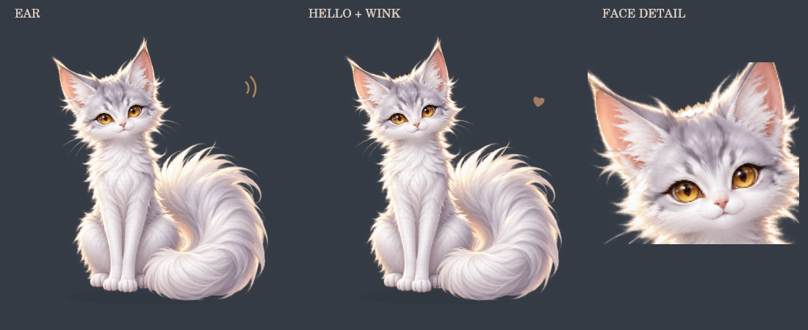

# 糯叽桌宠 Nuoji Pet

一只住在 SillyTavern 页面里的银白猫狐。糯叽会听你说话、陪模型思考、迎接新回复，也可以被拖到屏幕上任意位置——猫猫陪你把故事慢慢写下去。

这是 GPT × Ripple 一起搓、早期版本经 Fable51 工程审校的会眨眼、会甩尾、会明显动耳、会闭眼趴睡、会缩成咕噜噜毛团，也会用四条独立小腿自然迈步来陪你的 `v0.18.1`。




## 现在会什么

- 悬浮在 SillyTavern 页面上，猫身可摸可拖、透明区域可以点穿
- 鼠标和手机触摸都能拖动，位置会保存
- 点一下摸摸、双击让她歪头蹭蹭你、长按听她报时间和今日聊天统计；按 Enter / 空格也能摸摸
- 在输入框开始打字时，糯叽会明显竖耳、左右错开转耳，耳根下的头部花纹保持固定；停笔 3 秒后安静回到陪伴
- “歪头打招呼”会轻轻歪头，单眼 wink 一下，再睁眼回正；四只小爪安稳坐好，完整动作约 2.8 秒
- 待机 28 秒后会自己从坐姿柔和地趴下来；触摸、拖动、打字或生成开始时重新坐好
- 安静陪伴时会每隔约 42–78 秒偶尔起身，在安全范围内转向并走一小段，再坐下继续陪你
- 小步巡游只移动约 52–92 px，自动判断左右剩余空间；不会走出视口，也不会持续满屏乱跑
- 巡游时固定使用同一张头身尾母体，四条腿保持肩/髋根部固定，以柔性分层变形连续迈步，脸、耳朵、身体和尾巴不会换帧抖动
- 四条腿按“同侧后爪、同侧前爪、另一侧后爪、另一侧前爪”的四拍顺序依次落地；对角腿只轻微错拍呼应，不再完全同步成小跑
- 每只爪约 72% 的周期踩地承重，短摆动期才抬爪并轻轻收腿；前后爪会在腹下自然交错
- 步态相位由实际走过的距离计算，并缩短画面步幅、放慢巡游速度，脚掌与页面位移保持同步、不再滑步
- 输入、生成、触摸、拖动、切换聊天或其他反应会立刻打断巡游并安全落回坐姿
- 设置里可以关掉“让糯叽自己散步”，“减少动态效果”开启时也不会主动巡游；“糯叽走两步”按钮不受影响，随时可手动验收
- “困嘟嘟”预览直接使用趴姿；趴姿素材未就绪或加载失败时安全保留坐姿
- 进入“困嘟嘟”趴姿时会叠上专属柔和闭眼层，不再睁着眼睛冒 `Z`
- 正式生成开始时，大尾巴会把糯叽裹成银白小团子；流式输出期间持续贴地轻滚，token 到达时多咕噜一下
- 回复、停止或异常结束都会解开团子，再衔接原来的开心或迷糊动作
- 趴姿和团子按需懒加载并在首次使用后缓存，不增加酒馆启动与设置展开时的图片处理负担
- 行走身体、四条腿与腹毛遮罩也是首次巡游才解码；六张透明层已预处理，不会在手机上临时扫描绿幕图
- 日常会自然呼吸并约每 4.7 秒眨一次眼
- 原定妆图分层后，尾巴会按心情轻摆、快甩或困倦地慢慢晃
- 左右耳朵也能独立动作：听你说时快速竖起，思考时轮流弹耳，迷糊时单耳明显耷下，开心时连续抖两下
- 开心、被摸摸和睡觉时会切换真正绘制的闭眼眼周皮肤；眼皮线保留，灰黑眼圈已清干净
- 根据酒馆事件自动切换动作：
  - 发出用户消息：先竖起耳朵听你说
  - 开始生成：思考
  - 流式输出：常驻“让我想想…”并轻轻点头
  - 思考超过 20 / 40 秒：分别陪你说“这次想得久哦～”和“还在想呢…”
  - 完整回复渲染完成：开心
  - 停止或异常结束：迷糊
  - 切换聊天：歪头打招呼
- 设置面板可调整显示、大小、透明度、气泡和动态效果
- 展开糯叽自己的设置时，她会临时显示在移动端抽屉上方，方便实时预览
- 设置按钮不会再被窄按钮主题挤成竖排文字
- 适配 iPhone 安全视口、触摸拖动和屏幕旋转
- 关闭显示后会暂停 Canvas 动画，扩展停用或热重载时会完整清理监听
- 正式生成事件开始后才进入思考，并忽略其他扩展触发的 `quiet` / `dryRun` 后台生成
- 同时兼容流式与非流式的不同事件顺序，回信、停止和异常结束都会正确收尾
- 设置面板显示最近一次联动状态，手机上无需控制台也能判断有没有收到发送信号
- 不调用模型、不发送聊天内容、不额外消耗 token

`v0.2.0` 换上透明 2.5D 银白猫狐皮肤；`v0.3.x` 陆续加入眨眼、点击穿透、手机减负与可靠的流式生命周期；`v0.4.x` 让尾巴和两只耳朵按心情明显活动；`v0.5.0` 加入打字注视、久等陪伴话和三种触摸手势；`v0.6.0` 建起多形态框架并加入趴姿；`v0.7.0` 加入生成期间的滚动团子形态；`v0.8.x` 加入侧身巡游并验证整猫换帧路线；`v0.9.0` 改用固定身体与四腿小骨骼，`v0.9.1` 再把同步小跑校成距离驱动的四拍慢走。Canvas 继续负责呼吸、倾头、跳跃与状态特效。旧造型只在皮肤文件意外加载失败时应急出现。

## 本地安装测试

1. 解压下载包。
2. 确认目录结构是 `nuoji-pet/manifest.json`，不要多套一层同名文件夹。
3. 把整个 `nuoji-pet` 文件夹放进：

   ```text
   SillyTavern/data/<你的用户目录>/extensions/
   ```

4. 重启 SillyTavern，或刷新酒馆页面。
5. 打开“扩展”设置，展开“糯叽桌宠”即可调大小、透明度和预览动作。

等仓库发布到 GitHub 后，也可以在 SillyTavern 的“安装扩展”里直接粘贴仓库地址安装和更新。

## 操作

新增“蹭蹭你”：在扩展设置的动作区点击，或直接双击糯叽。一次约 4.2 秒，头颈带着脸颊轻蹭两次，耳朵放松、闭眼、摆尾，爪子留在原地。输入、拖动和生成都可中断；减少动态效果时只展示安静的贴贴姿势。也可调用 `window.NuojiPet.nuzzle()`。

- 点糯叽：摸摸她
- 双击糯叽：闭眼歪头蹭两下，再慢慢坐好
- 长按糯叽 600 ms：播报当地时间、今日卡数和新增角色回复数；气泡出现后 5 秒自动消失，松手不会提前关闭
- 拖糯叽：换位置，松手后自动保存
- 键盘选中糯叽后按 Enter / 空格：摸摸她
- 设置 → 扩展 → 糯叽桌宠：预览九种状态或重置位置
- 设置里的“糯叽走两步”：立即测试一次短距离巡游

## 给其他扩展联动

页面内可以发一个自定义事件让糯叽做动作：

```js
window.dispatchEvent(new CustomEvent('nuoji:react', {
    detail: {
        state: 'happy',
        message: '找到啦！',
        duration: 1800,
    },
}));
```

也可以使用简写：

```js
window.NuojiPet.react('sleeping', '困嘟嘟…', 3000);
```

可用状态：`idle`、`listening`、`thinking`、`happy`、`confused`、`petting`、`sleeping`、`wave`。

## 文件

- `manifest.json`：SillyTavern 扩展清单
- `CHANGELOG.md`：版本更新记录
- `index.js`：事件、拖动、设置与状态机
- `pet-renderer.js`：2.5D 皮肤播放器、状态动画与应急绘制
- `assets/nuoji-base-v1.png`：糯叽透明主皮肤
- `assets/nuoji-body-v2.png` / `nuoji-tail-v1.png`：保持原画像素的身体与尾巴层
- `assets/nuoji-ear-left-v1.png` / `nuoji-ear-right-v1.png`：可独立旋转的原画左右耳层
- `assets/nuoji-underpaint-v1.png`：只在尾巴摆开时露出的隐藏补毛层
- `assets/nuoji-closed-eyes-v2.png`：去掉灰黑眼圈的闭眼眼周透明小皮肤
- `assets/nuoji-lying-v2.png`：预先清净绿幕的趴姿，耳尖、耳后与颈毛不再留下荧光绿边
- `assets/nuoji-lying-closed-eyes-v2.png`：只覆盖趴姿双眼的柔和闭眼层；遮罩收紧并二次去绿，不再碰到耳后的绿幕区域
- `assets/nuoji-ball-green-v1.png`：尾巴环抱的团子生产母版，首次生成时一次性抠除纯色底并缓存
- `assets/nuoji-walk-green-v1.png`：唯一侧身行走母版，也是分层意外失败时的静态降级素材
- `assets/nuoji-walk-body-v3.png`：无腿、无尾的固定头身层，行走时最后绘制，整张胸腹毛就是四条腿根与尾根的遮罩；由 `tools/split_walk_tail.py` 从 v2 母版切出
- `assets/nuoji-walk-tail-v1.png`：行走用的大尾巴层，以尾根为轴单独摆动，画在四条腿和身体之下
- `assets/nuoji-walk-leg-front-far-v3.png` / `nuoji-walk-leg-hind-far-v3.png`：两条远侧腿；小腿与爪子来自母版并加宽 18%，上方是由 `tools/rebuild_far_legs.py` 从小腿毛发合成、朝肩/髋枢轴延伸的大腿柱，不再夹带近侧腿的毛片
- `assets/nuoji-walk-leg-front-near-v5.png` / `nuoji-walk-leg-hind-near-v5.png`：两条近侧腿（加宽 8%），带随腿旋转的柔和关节帽；关节帽整个藏在身体之下，只负责在摆动时补住腿根。前近腿不含脚掌，由 `tools/split_front_paw.py` 生成
- `assets/nuoji-walk-paw-front-near-v1.png`：近侧前爪的脚掌层，以手腕为轴单独旋转；承重时压平贴地，摆动时蜷起
- `assets/nuoji-walk-body-v2.png` / `nuoji-walk-leg-*-far-v2.png` / `nuoji-walk-leg-*-near-v2.png` / `nuoji-walk-leg-*-near-v4.png`：三个重建脚本的输入源图（v2 近腿只用作真实腿形参考），运行时不加载。更早的实验层已在 v0.10.0 删除，需要时可从 v0.9.11 的提交历史取回

坐姿与行走姿态之间使用约 190 ms 的“先收后放”单通道转场：中点前只绘制旧姿态，中点后才绘制新姿态，因此不会出现两只完整轮廓交叉叠影。趴姿与团子仍保留原有的柔和混合。
- `style.css`：悬浮层、手机适配和设置面板样式
- `settings.html`：酒馆扩展设置界面
- `preview.html`：不启动酒馆也能检查动作的本地预览页

## 性能与隐私

- Canvas 聊天页最多约 24 FPS；糯叽设置展开时自动降为约 12 FPS，开启“减少动态效果”后进一步降频
- 高 DPR 设备的画布最大为 750 × 750，并避开逐帧 CSS 滤镜合成
- 页面切到后台时停止实际绘制
- 流式 token 事件只触发轻微视觉脉冲，不读取 token 文本
- 没有网络请求、追踪、遥测或第三方依赖

流式生命周期的兼容判断参考了 [Sanj333 的公开打字指示器](https://gitee.com/Sanj333/SillyTavern-TypingIndicatorThemes) 所验证的事件顺序；糯叽保持轻量、独立实现。

## 下一步想搓的

- 给行走形态进一步拆出独立尾巴层，让尾巴按步态相位滞后摆动
- 让 RP 输出短 mood 标记，糯叽跟着剧情害羞、炸毛或开心
- 摸摸值、好感度和小鱼干，但控制体重
- 白天、夜晚和长时间陪伴动作
- 糯叽自己的小窝与配饰

## License

[MIT](LICENSE)


## 0.18.0 陪伴功能

扩展设置 → 糯叽桌宠 → **小气泡与陪伴**：选择场景，每行写一句，自动保存并随机使用；留空使用默认台词，也可恢复当前场景默认。支持 `{时间}`、`{时段}`、`{角色名}`、`{今日卡数}`、`{今日层数}`、`{当前楼层}`。每个场景最多 30 句、每句 240 字，按纯文本显示。

长按 600 ms 或点设置里的“听听今日播报”；键盘聚焦糯叽后 Shift + Enter / 空格也可播报。问候和播报使用设备当地时间，跨午夜自动换新一天，不发额外模型请求。

统计从启用后开始，只记录观察到生成过程的新角色回复；不回填以前的活动，不扫描其他聊天文件。用户消息、系统消息、重生成、续写、候选切换、旧聊天加载均不增加今日层数。卡数按当天有新回复的角色头像标识去重，群聊按实际回复角色计算。当前楼层指本聊天角色回复总数，包含开场白，不是酒馆所有消息的序号。删除已计回复不扣除当天活动量。

台词和当日统计跟随酒馆账户的扩展设置保存，刷新可保留；关闭糯叽暂停记录。只保留当日的去重信息，不保存聊天正文；多个设备或标签页同时写设置时依赖酒馆自身的保存机制，不提供实时合并统计。
